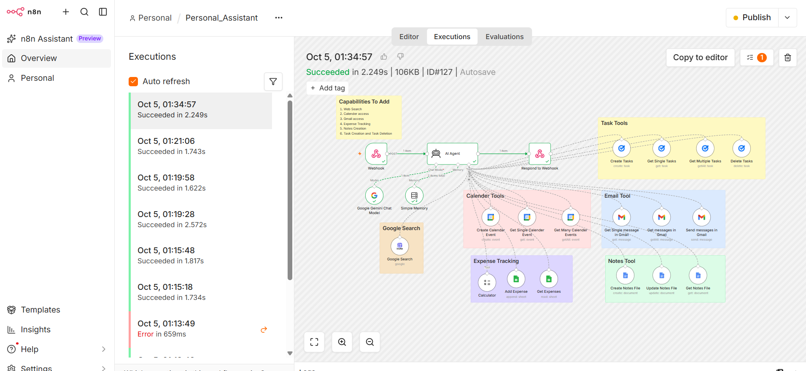
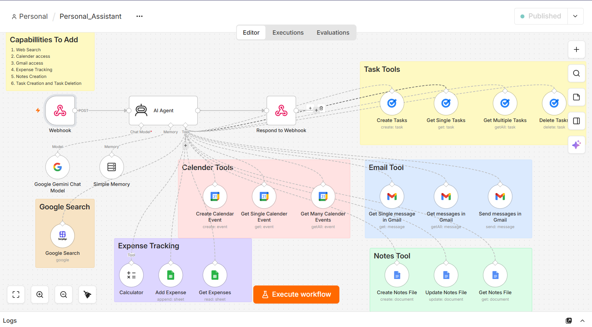

# Personal Assistant AI Agent (n8n + Gemini + Streamlit)
**Demo Video:** [Watch Here] https://lnkd.in/p/dxdpkHUS

An AI personal assistant that manages email, calendar, tasks, notes and expenses through natural language chat.



## Features
- Answers questions with live web search (SerpApi)
- Creates and fetches Google Calendar events
- Reads, summarizes and sends Gmail messages
- Creates, fetches and deletes Google Tasks
- Creates and updates notes in Google Docs
- Tracks expenses in Google Sheets with calculator support
- Per-session conversation memory

## Architecture
Streamlit UI → n8n Webhook → AI Agent (Gemini + Memory + Tools) → Respond to Webhook



## Tech Stack
n8n (self-hosted with Docker), Google Gemini, SerpApi, Google Workspace APIs, Python, Streamlit

## Project Structure
```
├── app.py            # Streamlit chat frontend
├── workflow.json     # n8n workflow (import into n8n)
├── requirements.txt
└── screenshots/
```

## Setup
1. **Run n8n with Docker**
   ```
   docker run -d --name n8n -p 5678:5678 -v n8n_data:/home/node/.n8n docker.n8n.io/n8nio/n8n
   ```
2. Open `http://localhost:5678` and import `workflow.json`.
3. Connect your own credentials in n8n: Google Gemini, Gmail, Calendar, Tasks, Docs, Sheets, SerpApi.
4. Enable these APIs in Google Cloud Console: Gmail, Calendar, Tasks, Docs, Sheets, Drive.
5. Create a Google Sheet with columns `ID`, `Date `, `Expense Category`, `Expanse`, `Remarks`, then select it in the Add Expense and Get Expenses nodes.
6. Select your Google Tasks list in the four Task nodes.
7. Publish the workflow and copy the **Production URL** from the Webhook node.
8. Paste that URL into `WEBHOOK_URL` in `app.py`.
9. Install and run:
   ```
   pip install -r requirements.txt
   streamlit run app.py
   ```

## Example Prompts
- "Summarize my latest email"
- "What meetings do I have today?"
- "Add an expense of 40 rupees for tea"
- "Note down: revise n8n webhooks"
- "Create a task to submit the assignment"

## Challenges Solved
- **Agent loops and token usage:** limited max iterations and tool output size
- **Gemini 429/503 errors:** retry on fail and model fallback
- **Agent ignoring user input:** moved instructions into the System Message and mapped the webhook field in the user prompt
- **Memory mixing between chats:** session ID sent from Streamlit and used as the memory key

## Security Note
The webhook has no authentication by default. Add Header Auth and run it behind HTTPS before exposing it publicly, since the agent has access to Gmail and Calendar.

## Author
Aadarsh Sharma | [LinkedIn](https://www.linkedin.com/in/aadarsh-sharma-57b788288) | [GitHub](https://github.com/14aadarsh)
